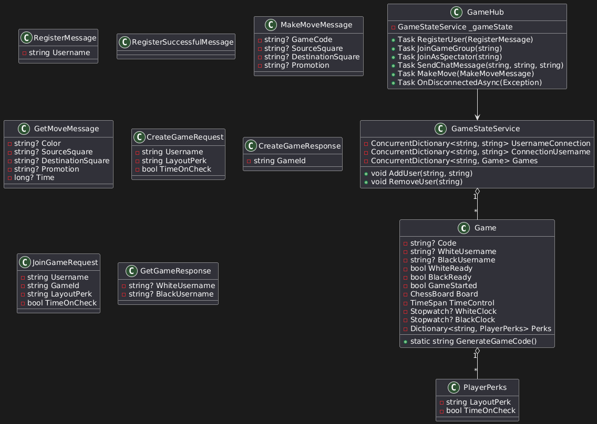
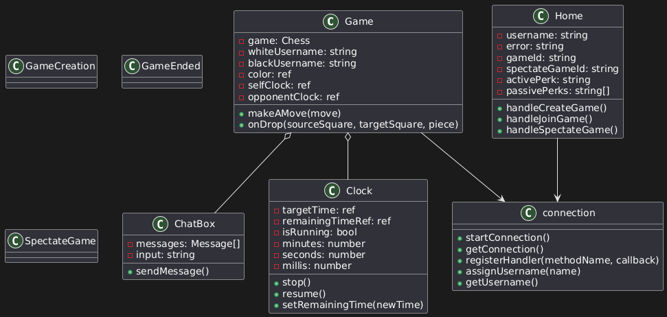
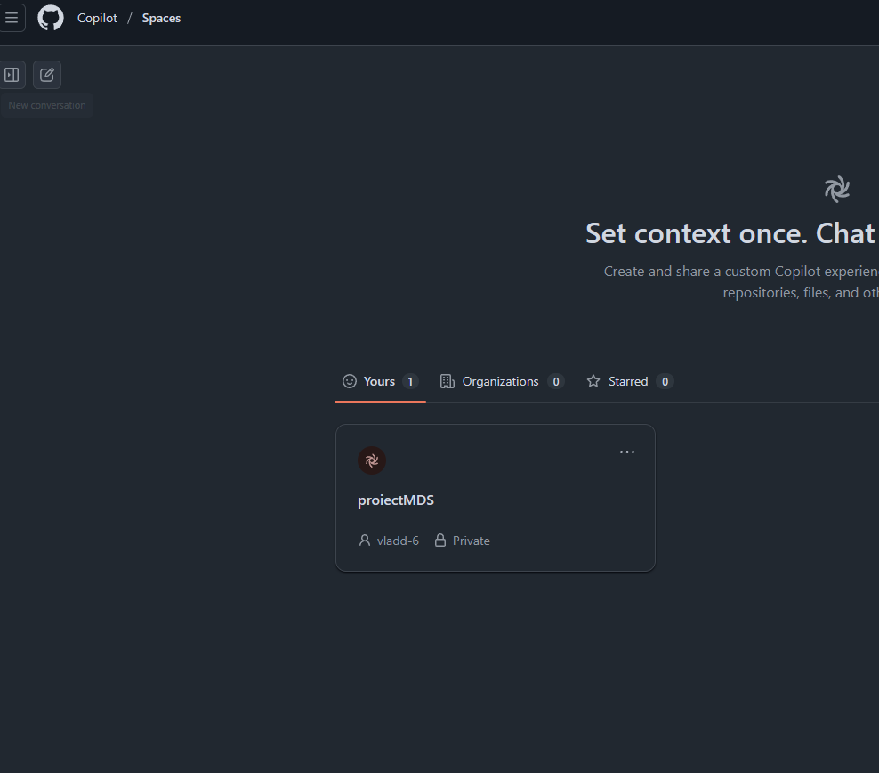
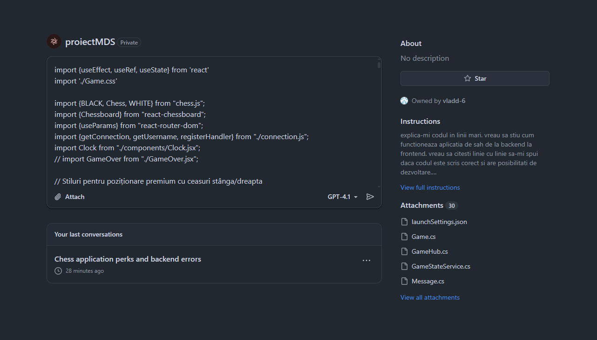
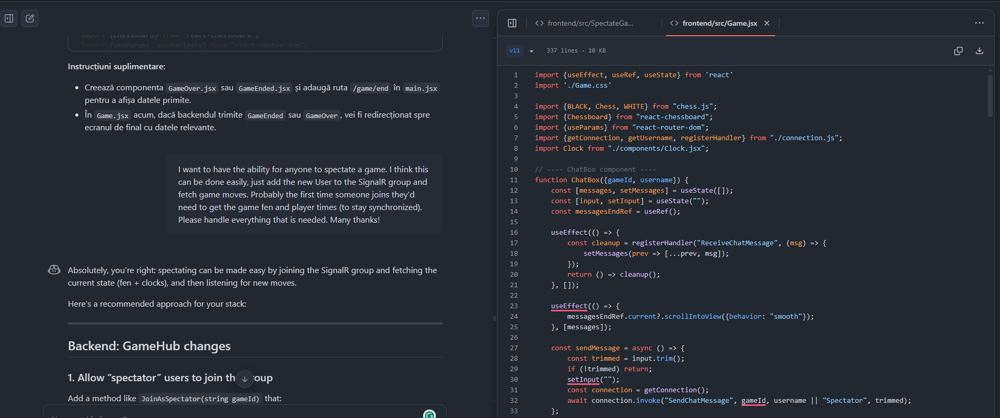
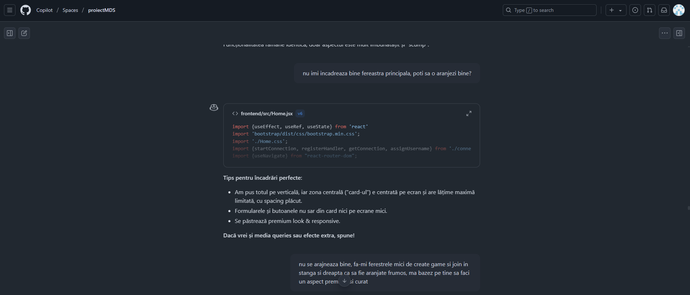

# ChessV2 - Proiect MDS

## Descriere generală

**ChessV2** este o aplicație web modernă pentru jocul de șah, dezvoltată ca proiect în cadrul materiei Metode de Dezvoltare Software (MDS), cu scopul de a demonstra atât implementarea funcționalităților clasice de șah, cât și integrarea de concepte avansate precum perks (avantaje speciale alese de jucători), chat sincronizat și mod spectate. Proiectul a fost realizat utilizând un proces de dezvoltare software complet, cu accent pe practici agile, versionare avansată, testare, design patterns și colaborare asistată AI.

## Tehnologii folosite

- **Frontend:** React, Vite, Bootstrap, react-chessboard, SignalR JS
- **Backend:** .NET 8, SignalR, Gera.Chess pentru logică șah
- **Comunicare:** SignalR pentru sincronizare real-time
- **Colaborare și AI:** GitHub Copilot, ChatGPT pentru generare și optimizare cod, brainstorming și prompt engineering

## Cerințe și acoperire

#### 1. User stories & backlog
- Am identificat și documentat peste 10 user stories relevante, acoperind atât rolul de jucător, cât și de spectator sau dezvoltator.
- Backlogul a fost organizat și prioritarizat înaintea dezvoltării.

#### 2. Diagrame (UML, workflow)
- Proiectul dispune de diagrame de arhitectură, workflow și UML de clase pentru backend și frontend, ilustrând fluxul de date, interacțiunea SignalR și structura perks-urilor.

#### 3. Source control cu git
- Au fost folosite branch-uri tematice pentru funcționalități, pull request-uri pentru validare, peste 10 commits, precum și operațiuni de merge și rebase.
- Toate modificările semnificative au fost urmărite cu mesaje de commit clare.

#### 5. Raportare bug & rezolvare prin pull request
- Au fost raportate și remediate bug-uri semnificative (ex: promoția pentru regina nu functiona) prin issues și pull request-uri dedicate.

#### 6. Comentarii cod & code standards
- Codul sursă este documentat cu comentarii relevante, naming consistent și respectarea standardelor de stil pentru fiecare limbaj utilizat.

#### 7. Design patterns
- Backendul utilizează pattern-uri precum Singleton (GameStateService), Service Layer și Observer (prin SignalR pentru events).
- Frontendul folosește compoziție și reutilizare de componente.

#### 8. Prompt engineering & AI tools
- Pe tot parcursul dezvoltării am folosit GitHub Copilot și ChatGPT pentru generare rapidă de cod, brainstorming de perks, design UI și identificare bug-uri.
- Prompturile au fost formulate profesionist, cu context clar și exemple, pentru a obține output relevant și optimizat.

---

## Funcționalități principale

### 1. Joc de șah sincronizat real-time
- Mutările, ceasurile și statusul jocului sunt sincronizate instant între jucători și spectatori prin SignalR.
- Fiecare joc are un cod unic și o sesiune proprie.
- Interfață intuitivă, modernă și responsive.

### 2. Sistem de perks (funcționalități premium)
- La începutul fiecărui joc, jucătorii pot alege:
  - **Un perk activ:** modifică layoutul pieselor (ex: 3 cai + un nebun, 3 nebuni + un cal).
  - **Până la 2 perks pasive:** modifică regulile în timpul jocului (ex: +15s la ceas când dai șah).
- Perks-urile sunt transmise la backend, afectează FEN-ul inițial și/sau logica de joc.
- Sistemul este modular, permițând adăugarea rapidă a unor perks noi.

#### Exemple de perks implementate:
- **Active:**
  - "3knights": Înlocuiește o piesă inițială cu un cal suplimentar.
  - "3bishops": Înlocuiește o piesă cu un nebun suplimentar.
- **Passive:**
  - "Time on Check": Primești +15 secunde la ceas când dai șah.

#### Alte idei de perks echilibrate:
- "Double Castling": Permite rocada pe ambele flancuri indiferent dacă ai pierdut dreptul la una.
- "Knight Jump": O dată pe partidă, poți muta un cal ca un nebun.
- "Extra Move": O dată pe partidă, poți face două mutări consecutive (cu restricții).
- "Shield King": O dată, poți ignora un șah fără să fie mat.

### 3. Chat live sincronizat
- Chat-ul este activ atât pentru jucători, cât și pentru spectatori, cu mesaje transmise instant în grupul jocului.
- UI elegant, scroll automat, poziționare laterală, ușor de folosit.

### 4. Spectate mode
- Oricine poate introduce codul unui joc pentru a urmări live partida: mutări, ceasuri, chat.
- Spectatorii nu pot influența jocul, dar pot comunica în chat.

### 5. Interfață premium, responsive
- Toate componentele folosesc un design coerent, modern, cu temă premium, adaptabilă la orice dispozitiv.
- Meniul principal permite selectarea perks-urilor, crearea și alăturarea unui joc sau accesarea modului spectate.

---

## Structură și extensibilitate

- **Backend (.NET)**
  - `Game.cs`: modelul principal pentru stare de joc, incluzând perks per jucător, ceasuri, cod unic etc.
  - `GameHub.cs`: SignalR hub pentru managementul mutărilor, perks-urilor, chat, conectare.
  - `GameStateService.cs`: Singleton pentru asociere user-connection și management sesiuni.
  - API REST pentru creare, join și informare sesiuni.

- **Frontend (React)**
  - `Home.jsx`: meniu principal, alegere perks, create/join/spectate.
  - `Game.jsx`: logica de joc, mutări, ceasuri, perks, chat.
  - `SpectateGame.jsx`: vizualizare live.
  - `components/ChatBox.jsx`, `components/Clock.jsx`: componente reutilizabile.
  - `connection.js`: gestionare SignalR, extensibil ușor cu noi handlers.

Arhitectura modulară permite adăugarea rapidă de perks, extensii la chat, leaderboard, turnee etc.

---

## User Stories

* As a user, I want to be able to create a game so that I can invite an opponent to play with.
* As a user, I want to be able to join a game created by another user.
* As a user, I want to be able to access the app without having to create an account.
* As a player, I want to be able to choose my perks before the match starts.
* As a player, I want to have an active perk and 2 passive perks, being able to choose them from predefined perks.
* As a player, I want to be able to see my opponent's perks.
* As a player, I want to have visual hints on the chess table, such as available legal moves and piece score difference.
* As a player, I want to be able to see my clock and my opponent's clock.
* As a player, I want to be able to surrender, ending the match earlier.
* As a player, I want to be able to issue a rematch, which my opponent can accept.
* As a user, I want to be able to spectate an ongoing match
* As a user, I want to be able to see a history of my last games
* As a user, I want to comment on an ongoing match
* As a user with an account, I want to be able to contact other users
* As a player, I want to have the option to send messages to my opponent

## Concluzii și perspective

ChessV2 demonstrează implementarea unui sistem de perks și chat live peste un joc clasic de șah, cu arhitectură modernă, scalabilă și documentată.  
Procesul de dezvoltare a respectat exhaustiv cerințele academice, cu accent pe colaborare, versionare, testare și integrare AI.  
Aplicația este ușor de extins și poate servi ca bază pentru dezvoltări viitoare: leaderboard, turnee, noi perks, moduri de joc alternative sau AI opponent.
